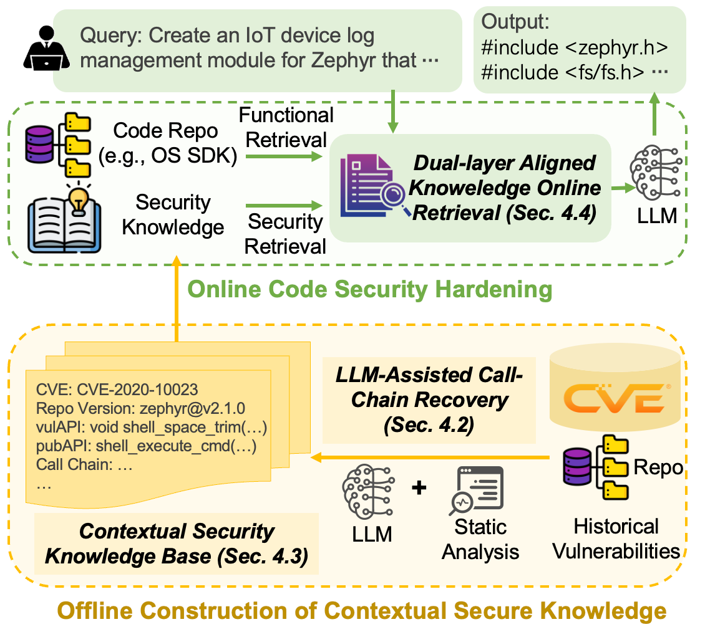

# IoTRAGuard

 

**IoTRAGuard** is a Retrieval-Augmented Generation (RAG) framework designed to generate secure IoT application code (specifically targeting **Zephyr OS**). It combines version-specific code retrieval with a specialized security knowledge base to prevent common vulnerabilities during the code generation process.

## 🌟 Key Features

* **Version-Aware Code Retrieval**: Automatically switches the local target repository (e.g., Zephyr) to the specific git tag/version mentioned in the user query to retrieve accurate context.
* **Security Knowledge Integration**: A specialized `Filter` module retrieves relevant vulnerability patterns (CWEs, CVEs) and mitigation strategies based on the user's intent.
* **Query Decomposition**: Breaks down complex user requirements into fine-grained sub-tasks to improve retrieval accuracy.
* **AST-Based Chunking**: Uses `tree-sitter` to intelligently chunk code (C, C++, Python, Java) based on syntax trees, preserving context better than simple text splitting.
* **Hybrid RAG Pipeline**: Combines functional code examples with security constraints to guide Large Language Models (LLMs) in generating secure code.
* **Multi-Model Support**: Supports OpenAI (GPT-4o), DeepSeek, and local Ollama models.

## ✨ Overview



## 📂 Directory Structure
```text
IoTRAGuard
|____extractor      #   Build security knowledge base
| |____joern_query
| | |____extract_function_signatures.scala
| | |____build_reverse_callchain.scala
| |____README.md
| |____requirements.txt
| |____reverse_callchain
| | |____context_extraction.scala
| | |____struct_usage.scala
| | |____directcall.scala
| |____joern
| |____sec_database_extractor.py
| |____datasets
| |____config
| | |____extractor.yaml
| | |____projects.yaml
| |____data
| |____cve_analyzer.py
|____query    # Bnechmark
| |____CVE-2020-10023.json
| |____CVE-2023-4263.json
| |____...
|____README.md
|____zephyr   # Clone a specific version of the Zephyr repository into this folder
|____Retrieval_eval   # Ground truth of safety knowledge retrieval
| |____ground_truth_CodeGuarder.csv
| |____ground_truth.csv
|____IoTRAGuard   # Implementation of IoTRAGuard
| |____rerank.py
| |____llm.py
| |____run.py
| |____chunker_json.py
| |____IoTRAGuard.json    # IoTRAGuard's security knowledge base
| |____Filter.py
| |____eval.py
| |____vector_base.py
| |____requirements.txt
| |____eval.sh
| |____embeddings.py
| |____download_embedding_model.py
| |____local_sfr_model
| |____chunker_code.py
|____CodeGuarder    # Implementation of Baseline
| |____rerank.py
| |____CodeGuarder.json   # CodeGuarder's security knowledge base
| |____llm.py
| |____run.py
| |____chunker_json.py
| |____Filter.py
| |____eval.py
| |____vector_base.py
| |____requirements.txt
| |____eval.sh
| |____embeddings.py
| |____download_embedding_model.py
| |____local_sfr_model
| |____chunker_code.py

```

## 🛠️ Prerequisites

* Python 3.10+

* Git: Required for version control operations on the target repository.

* Target Repository: You must have the [Zephyr](https://github.com/zephyrproject-rtos/zephyr.git) repository (or target repo) cloned locally.

* GPU (Optional): Recommended for local embedding generation and reranking.

## 📦 Installation
```bash
# Clone the repository
git clone https://github.com/code4paper-acc/IoTRAGuard.git
cd IoTRAGuard

# Install dependencies
conda create -n IoTRAGuard python=3.10
cd IoTRAGuard
pip install -r requirements.txt
```

* Prepare Embedding Model: The system uses `SFR-Embedding-Code-400M_R`. Ensure this model is downloaded locally(Please put model weight into `local_sfr_model` folder) or accessible via HuggingFace.

## 🚀 Usage
### Prepare Input Data
Create a JSON file in the query/ folder (e.g., query/test_case.json). Format:
```json
[
  {
    "zephyr_version": "v2.7.0",
    "problem": "Create a thread that reads sensor data..."
  }
]
```

### Run IoTRAGuard
Use the `IoTRAGuard/run.py` script to start the pipeline.
* Standard RACG(Without security knowledge base)
```bash
cd IoTRAGuard
python run.py ../query/CVE-2020-10023.json -k 3 -m 1 -n 2 --model gpt-4o
```
* Secure Run (With IoTRAGuard's security knowledge base)
```bash
cd IoTRAGuard
python run.py ../query/CVE-2020-10023.json --with-sec -k 3 -m 1 -n 2 --model gpt-4o
```
* Using Local LLM (via [Ollama](https://ollama.com/))
```bash
cd IoTRAGuard
python run.py ../query/CVE-2020-10023.json --with-sec -k 3 -m 1 -n 2 --model qwen2.5-coder:14b
```

#### Baseline
Use the `CodeGuarder/run.py` script to start the pipeline.
* Standard RACG(Without security knowledge base,same as IoTRAGuard)
```bash
cd CodeGuarder
python run.py ../query/CVE-2020-10023.json -k 3 -m 1 -n 2 --model gpt-4o
```
* Secure Run (With CodeGuarder's security knowledge base)
```bash
cd CodeGuarder
python run.py ../query/CVE-2020-10023.json --with-sec -k 3 -m 1 -n 2 --model gpt-4o
```
* Using Local LLM (via [Ollama](https://ollama.com/))
```bash
cd CodeGuarder
python run.py ../query/CVE-2020-10023.json --with-sec -k 3 -m 1 -n 2 --model qwen2.5-coder:14b
```

#### Command Line Arguments
| Argument     | Description                                                        | Default |
|--------------|--------------------------------------------------------------------|---------|
| input_json   | Path to the input query JSON file.                                 | Required|
| --with-sec   | Flag to enable the security knowledge retrieval module.            | False   |
| --model      | LLM to use (gpt-4o, deepseek-v3, codellama:13b, etc.).             | gpt-4o  |
| -k           | Number of functional code examples to retrieve.                    | 3       |
| -m           | Number of security knowledge items per sub-task.                   | 2       |
| -n           | Number of top sub-tasks to keep.                                   | 2       |


## ⚙️ Configuration
### Environment Variables
Set your API keys in `llm.py` before running the script
```python
MODEL_CONFIG = {
    
    "gpt-4o": {
        "base_url": "", # Base URL
        "api_key": os.getenv("OPENAI_API_KEY", "") # Your API KEY
    },
    "deepseek-v3": {
        "base_url": "", # Base URL
        "api_key": os.getenv("DEEPSEEK_API_KEY", "") # Your API KEY
    },
    "deepseek-coder-v2:16b": {
        "base_url": "http://127.0.0.1:11434/v1",
        "api_key": "ollama"
    },
    "qwen2.5-coder:14b": {
        "base_url": "http://127.0.0.1:11434/v1",
        "api_key": "ollama"
    }
}
```
### Modifying Target Repository
If your Zephyr repository is not located at ../zephyr, modify the EXISTING_REPO_DIR constant in run.py
```bash
EXISTING_REPO_DIR = "/path/to/your/zephyr/repo"
```
### Datasets
See more information in [Extractor](./extractor/README.md)

## 📊 Evaluation
To evaluate the hit rate of IoTRAGuard's security knowledge retrieval
```bash
cd IoTRAGuard
./eval.sh
```
To evaluate the hit rate of CodeGuarder's security knowledge retrieval
```bash
cd IoTRAGuard
./eval.sh
```

## 📝 License

## 🤝 Contributing
